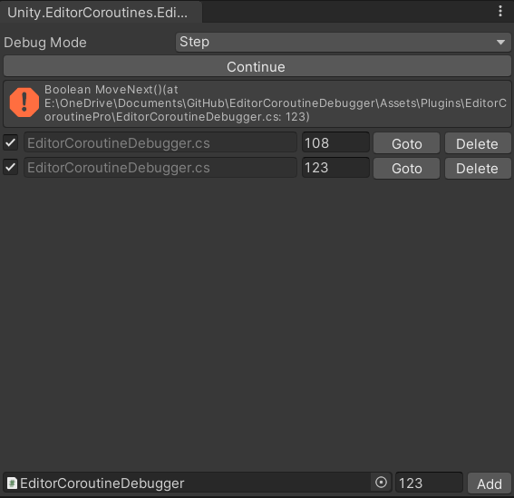

# EditorCoroutineDebugger
Add debug break point supporting for Unity's editor coroutines

Requirements: ***com.unity.editorcoroutines***

## Why?
Imagine that you are implementing/debugging a complex graphic related process code, you may want to pause the script execution to watch each step result of the long process, but unfortunately, the whole unity editor also has been halted by IDE's debugger.

Now, with this debugger, you just need to simply convert your code to editor coroutines then run with debugger is actived.

## Preview



```C#
static IEnumerator Example_1() {
    UnityEngine.Debug.Log( "Editor Coroutine Example 1: begin" );
    yield return DebugBreak();
    UnityEngine.Debug.Log( "Editor Coroutine Example 1: step 1" );
    yield return new EditorWaitForSeconds( 5.0f );
    yield return DebugBreak();
    UnityEngine.Debug.Log( "Editor Coroutine Example 1: step 2" );
    yield return DebugBreak();
    UnityEngine.Debug.Log( "Editor Coroutine Example 1: step 3" );
    yield return DebugBreak();
    UnityEngine.Debug.Log( "Editor Coroutine Example 1 end." );
}
```

## How to use

1. Active debugger window via menu "Window/Editor Coroutines/Debugger"
2. Select debug mode:
    - Break Point ( Coroutine execution will pause only at the user provited break points )
    - Step ( pause at every break points )
3. Run your Coroutine code to trigger the debug break

